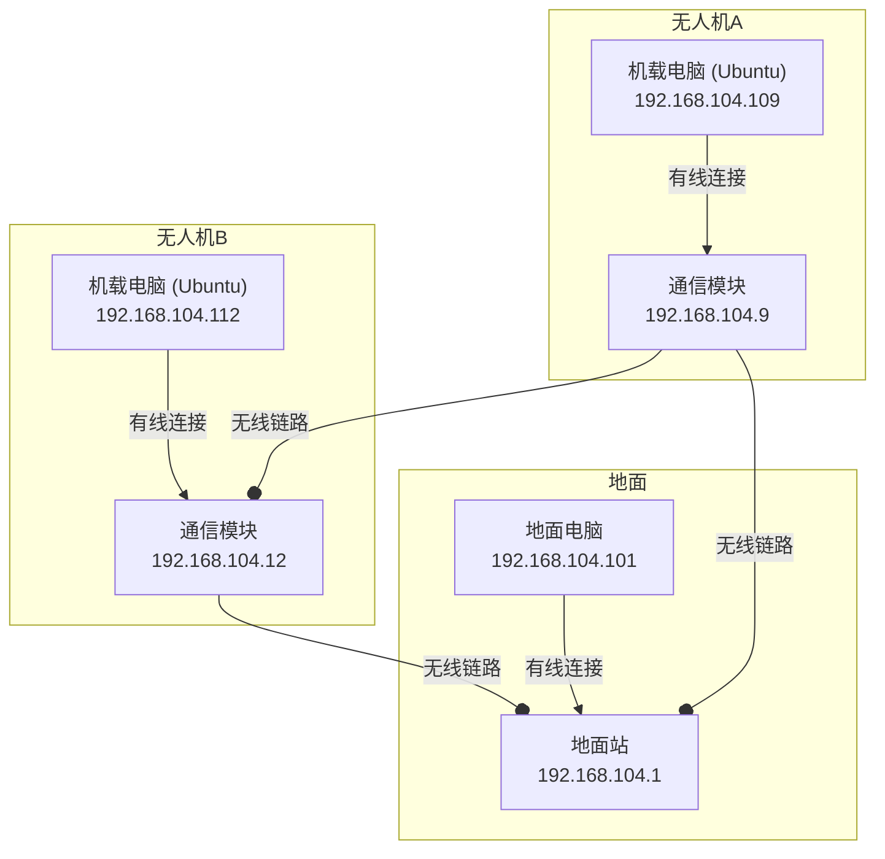

### 1. 需求梳理

经过我们的对话，您的核心需求可以总结如下：

- **最终目标**: 精准测试两架无人机之间直接通信的信道模型，核心指标是单向通信时延。
- **测试方法**: 两台机载电脑 (`192.168.104.109` 和 `192.168.104.112`) 互相发送内嵌时间戳的UDP包来计算时延。
- **网络环境**: 一个由地面站和两架无人机通信模块组成的自组网（Mesh Network）。
- **核心挑战**: 必须确保测试用的UDP包**只在两架无人机之间直接传输**，绝不能通过地面站进行中继转发，否则测得的时延数据将是错误的。
- **关键约束**: 在进行测试的同时，必须**保持地面电脑与两台机载电脑之间的正常通信**，以便于下发指令、监控状态和接收遥测数据。
- **技术平台**: 机载电脑的操作系统为Linux (Ubuntu)。

### 2. 网络拓扑图




### 3. 解决方案汇总与对比

#### 3.1. 方案一：静态路由 (Static Routing) -【最推荐】

这是最标准、最可靠的网络层解决方案。

- **原理**: 在操作系统的IP层（三层）强制指定一个规则：凡是发往特定目标IP的数据包，其下一跳（Next Hop）必须是某一个指定的IP地址。这相当于给数据包设定了精确的导航路线。
- **优点**:

- **极其可靠**：作为网络协议的标准功能，行为确定，不受硬件具体实现影响。
- **逻辑清晰**：直接从网络路由层面解决问题，思路清晰。
- **维护性好**：配置相对直观，容易排查问题。

- **缺点**:

- 需要`root`权限进行配置。

- **Ubuntu配置方法**:
    在两台机载电脑上分别执行。现代Ubuntu系统推荐使用 `ip` 命令。

1. **在机载电脑** `192.168.104.109` **上执行**:

```bash
sudo ip route add 192.168.104.112/32 via 192.168.104.12
```

*这条命令告诉*`.109`*，要去往主机*`.112`*，必须通过*`.12`*（无人机B的通信模块）走。*

1. **在机载电脑** `192.168.104.112` **上执行**:

```bash
sudo ip route add 192.168.104.109/32 via 192.168.104.9
```

*这条命令告诉*`.112`*，要去往主机*`.109`*，必须通过*`.9`*（无人机A的通信模块）走。*

1. **如何持久化**: 以上命令在重启后会失效。要使其永久生效，建议使用 `netplan`（Ubuntu 17.10+ 默认网络管理工具）。编辑 `/etc/netplan/` 目录下的YAML配置文件（例如 `01-netcfg.yaml`），在对应的网卡配置下增加 `routes` 项：

```yaml
# 在 .109 电脑上的配置示例
network:
  version: 2
  ethernets:
    eth0:
      addresses: [192.168.104.109/24]
      # ... 其他配置 ...
      routes:
        - to: 192.168.104.112/32
          via: 192.168.104.12
```

修改后执行 `sudo netplan apply` 使其生效。

#### 3.1.1. 一键化配置（`start_test.sh` 集成）

为避免每次手工敲命令，现在的测试脚本已经内置静态路由功能：

- 新增参数：
  - `--enable-static-route`
  - `--static-route-via=<下一跳IP>`（必填，通常填“对端通信模块”的IP，例如 `.12` 或 `.9`）
  - `--static-route-interface=<网卡名>`（可选，推荐填写 mesh 接口，如 `bat0`）
- 路由规则：自动创建 `ip route add <peer-ip>/32 via <static-route-via> [dev <interface>]`。
- 清理机制：脚本退出时会自动删除它添加的 host route，防止影响地面站与无人机的常规通信。

**示例：在无人机B的机载电脑（192.168.104.112）上启动接收端，只允许UDP走 12 ↔ 9 路径**

```bash
./start_test.sh receiver \
  --local-ip=192.168.104.112 \
  --peer-ip=192.168.104.109 \
  --enable-static-route \
  --static-route-via=192.168.104.9 \
  --static-route-interface=bat0 \
  --enable-nexfi --nexfi-ip=192.168.104.12
```

**同理，在无人机A（192.168.104.109）上启动发送端**

```bash
./start_test.sh sender \
  --local-ip=192.168.104.109 \
  --peer-ip=192.168.104.112 \
  --enable-static-route \
  --static-route-via=192.168.104.12 \
  --static-route-interface=bat0
```

> 这样，测试用的 UDP 流量被强制走 .12 ↔ .9，自然不会经过地面站 .1；而其他控制/监控流量仍按默认路由走地面站，不会互相干扰。
